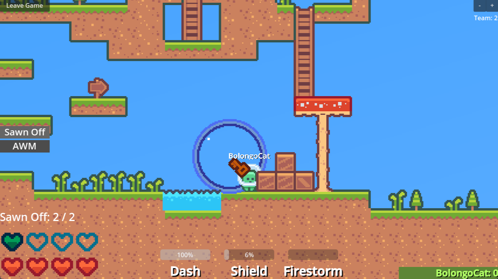

# Glob Game
This is the documentation for **Glob Game**. It is a small multiplayer scavenger battle-royale game made in **Godot**.
It was started on **March 16** (means it's a Pisces) and created by 3 people.

## Purpose
**Glob Game** was made to be a game to be played by an entire CS class at the end of school, as a way to provide inspiration to continue with CS and thrive. However, it has taken some turns since then and will probably end up else where.
## Screenshots

